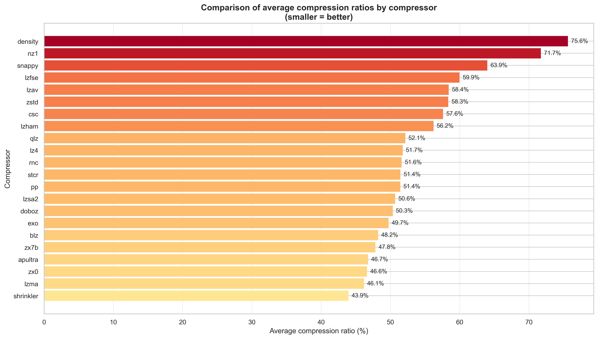
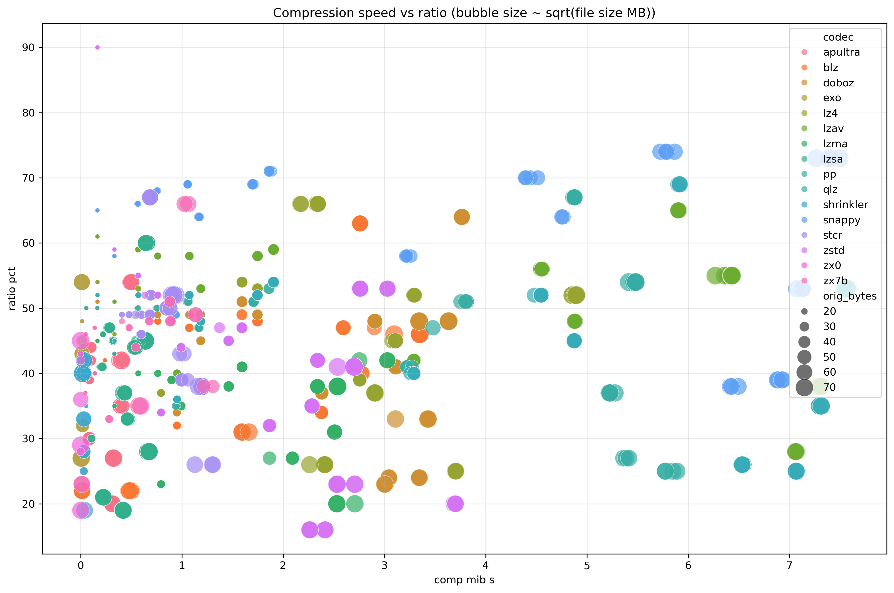
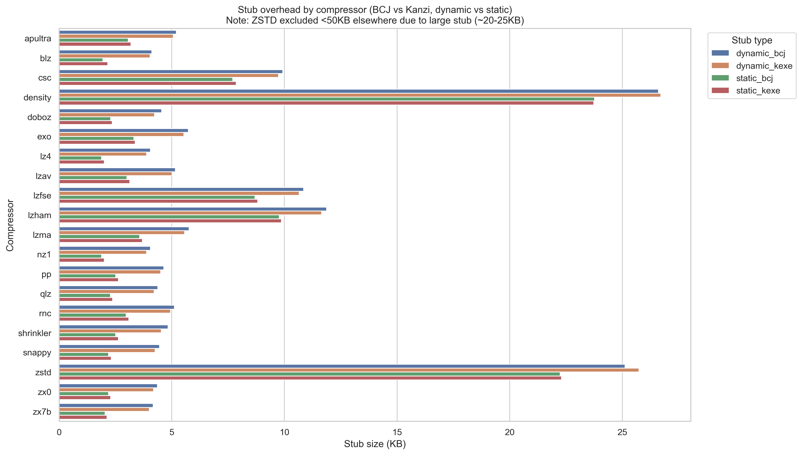

# zELF — x86_64 ELF packer
<p align="center">
  
</p>


zELF is an ELF64 packer for Linux x86_64, inspired by UPX but with a modular structure: 22 compression codecs, the ability to integrate your own codecs, two executable filters (BCJ, KanziEXE) and automatic selection via ML models. It handles static and dynamic/PIE binaries, provides a `.zlf` archive mode, and brute-force helper modes (`-best`, `-crazy`) that explore multiple combinations to maximize ratio.

## Key features
- Multi-codec compression: LZ4, LZMA, ZSTD, Apultra, ZX7B, ZX0, BriefLZ, Exomizer, PowerPacker, Snappy, Doboz, QuickLZ, LZAV, Shrinkler, StoneCracker, LZSA2, CSC, Density, LZFSE, LZHAM, NZ1, RNC.
- EXE filters: BCJ and KanziEXE, automatic selection via trained decision trees (default mode `auto`).
- ELF support: static and dynamic/PIE binaries, strict header and segment validation.
- `-best` mode: picks 3 predicted codecs based on binary size, tests filters `bcj → kanzi → none`, keeps the smallest.
- `-crazy` mode: tries all codecs with `bcj → kanzi → none`, keeps the smallest.
- Archive mode `.zlf` and unpack (`--archive`, `--unpack`).
- Password option (FNV-1a hash obfuscated in the stub).
- Compact nostdlib stubs (1.5–22 KB), repacked into the final binary.
- Analysis tools (elfz_probe, filtered_probe) in `build/tools/`.

## Platform and limits
- Targets Linux x86_64, ELF64 only. ELF 32-bit is not supported.
- Some codecs may require very large amounts of memory during compression. In particular, `-lzham` uses a 512MB dictionary and will abort early with an explicit error message if available RAM (or `RLIMIT_AS`) is insufficient.
- Please note that zELF is not designed for code obfuscation or concealment. All source code is openly available, and even the more exotic compression format can be integrated and parsed by any analysis tool thanks to the provided sources. The goal of this packer is binary size reduction and efficient runtime unpacking—not evasion of antivirus software or distribution of malicious code. It is intended for legitimate use cases such as embedded systems, demos, general binary optimization or educational purposes like studying ELF structure and advanced packing techniques.

  
## Why zELF exists
Executable packers have always fascinated me — not just as tools, but as tiny pieces of engineering magic. They sit at the intersection of compression, binary formats, low‑level systems, and a bit of creative hacking.  
Among them, UPX (the godfather of executable packing!) stands as a masterpiece. It’s fast, reliable, brilliantly engineered, and has been the reference for decades.  
The goal of zELF is not to compete with upx, but to offer something different: a packer that is fully extensible, easy to understand, and fun to hack on.  
I wanted a packer that I could fully understand, fully control, and easily extend.  
I wanted a packer where adding a new compression algorithm is straightforward, documented, and encouraged.  
I wanted a codebase that reveals how ELF binaries work internally, how segments are mapped, how relocations are applied, and how an in‑memory unpacking stub operates. I wanted something I could fully control, adapt, and experiment with — especially for my own binaries.  

Another aspect I wanted to explore is automatic codec selection. zELF includes lightweight machine‑learning predictors trained on more than 2,000 Linux binaries (mostly from a base Debian system plus a variety of common executables). These predictors estimate which codec is likely to produce the smallest packed output, based on simple features extracted from the input binary. They’re not meant to be “AI magic”, just practical decision trees that save time and avoid brute‑forcing every codec when you don’t need to.  
  
zELF is also a playground for integrating historical compression algorithms from the 8‑bit and 16‑bit world, alongside modern codecs like ZSTD or LZMA. It’s a learning tool, a research project, and a practical packer all at once.  
It is released under GPLv3 license. 
  
  
## Benchmarks & Statistics

zELF includes 22 compression codecs and two EXE filters.  
To better understand their behavior, more than 2000 Linux binaries were analyzed
(mostly from a base Debian system plus a variety of common executables).

The `stats/results/` directory contains all datasets and graphs used for evaluating:

- compression ratios
- ratios by input size range
- speed benchmarks
- stub overhead
- ML predictor training data

Below are some representative graphs extracted from these datasets.

---

### Average compression ratios

This graph shows the average compression ratio achieved by each codec across the
entire dataset of 2000+ binaries.

<p align="center">
  
</p>

---

### Best codec by input size range

Different codecs behave differently depending on the size of the input binary.
This graph illustrates these variations and explains how the `-best` mode
selects the most promising codec without brute‑forcing all of them.

<p align="center">
  
</p>

---

### Speed vs compression ratio

Each codec has its own trade‑off between compression speed and final size.
This graph provides an overview of these differences.

<p align="center">
  
</p>

---

### Stub overhead

Each codec requires a different unpacking stub size.  
This graph shows the overhead added by each stub before compression.

<p align="center">
  
</p>

---

### Datasets

All raw statistics are available in the `stats/results/` directory:
- `average_compression_ratios.csv` — average ratios per codec  
- `rankings_by_size.csv` — best codec per size range  
- `speed_results_filtered.csv` — speed benchmarks  
- `ratio_distributions.png` — ratio variance  
- `predictor_rules.json` — ML decision trees  
- `predictor.py` — predictor implementation  

These datasets are used internally by zELF to improve heuristics and codec
selection, and are provided for transparency and experimentation.  
  

  
## Build
You can use the interactive menu to configure and launch the build:
```bash
make menu
```
Or use the manual commands below:

### Install dependencies
On Debian/Ubuntu:
```bash
make install_dependencies
```
On openSUSE:
```bash
make install_dependencies
```
For other distributions, install equivalents of: gcc/g++/make/nasm/pkg-config, zlib-dev, lz4-dev, zstd-dev, python3/pip, dpkg-deb, dialog/whiptail. For static builds, static libs (libstdc++/glibc) must be available on the system.

Note: depending on the toolchain, stubs may be compiled as PIE (`-fpie`) to avoid runtime crashes when embedded as raw binary blobs. This can slightly increase stub size (typically a few hundred bytes). If you care about the smallest possible stubs, building on Debian remains preferable.

### Build commands
```bash
# Full build (stubs, tools, packer)
make
# Static build
make STATIC=1
# Parallelize stub generation (default 2)
make STUBS_J=4 stubs
# Tools only
make tools
# Packages
make deb        # produces a .deb, suffix _static if STATIC=1
make tar        # produces a .tar.gz, suffix _static if STATIC=1
```
The final packer binary is `build/zelf`.

## Quick usage
```bash
./build/zelf [options] <elf_binary>
```
Main user options:
- Codec selection: `-lz4` (default), `-lzma`, `-zstd`, `-apultra`, `-zx7b`, `-zx0`, `-blz`, `-exo`, `-pp`, `-snappy`, `-doboz`, `-qlz`, `-lzav`, `-shr` (shrinkler), `-stcr` (stonecracker), `-lzsa`, `-csc`, `-density`, `-lzfse`, `-lzham`, `-nz1`, `-rnc`.
- EXE filter: `--exe-filter=auto|bcj|kanziexe|none` (ignored in `-best`, order forced bcj→kanzi→none).
- `-best` mode: tries 3 predicted codecs + filters, keeps the best.
- `-crazy` mode: tries all eligible codecs + filters, keeps the best.
- Strip: `--no-strip` disables super-strip before compression.
- Password: `--password` (prompts for password, random salt).
- Output: `--output <file|dir>`, `--nobackup` to avoid `.bak` when overwriting.
- Archives: `--archive` (creates `.zlf`), `--archive-tar` (creates `.tar.zlf` from a directory), `--archive-sfx` (creates a self-extracting `.sfx`), `--archive-tar-sfx` (creates a self-extracting `.tar.sfx` from a directory), `--unpack` (unpacks packed ELF or `.zlf`/SFX archive; auto-extracts `.tar.zlf`).
- Display: `--verbose`, `--no-progress`, `--no-colors`.

### Examples
```bash
# Simple pack (lz4 default), overwrites original after .bak backup beside it
./build/zelf /usr/bin/ls

# Pack with ZSTD + explicit BCJ filter
./build/zelf -zstd --exe-filter=bcj /usr/bin/ls --output /tmp/ls_packed

# -best mode (multi codec/filter tries), explicit output
./build/zelf -best /usr/bin/true --output /tmp/true_best

# Archive any file
./build/zelf -zstd --archive some_data --output archive.zlf

# Archive a directory (tar stream + compression)
./build/zelf -zstd --archive-tar ./folder --output folder.tar.zlf

# Archive a directory via a tar pipe (stdin)
tar -cf - folder/ | ./build/zelf --archive -shr - --output folder.tar.zlf

# Unpack a .zlf archive
./build/zelf --unpack archive.zlf --output restored_data

# Unpack and auto-extract a .tar.zlf archive
./build/zelf --unpack folder.tar.zlf
./build/zelf --unpack folder.tar.zlf --output ./target_dir/

# Restore a packed binary (in-place or to a new file)
./build/zelf --unpack /tmp/ls_packed --output /tmp/ls_original
```

## `-best` mode (details)
- Selects 3 codecs based on size (built-in table).
- Tests filters `bcj`, `kanzi`, `none` for each codec (9 attempts total).
- Keeps only the smallest binary.
- `--exe-filter` is ignored in this mode.
- If a combo produces a packed binary that is not smaller than the original, it is treated as a failed attempt and the mode continues.
- Cannot be combined with archive/unpack modes or explicit codec selection.

## `-crazy` mode (details)
- Tries all available codecs with filters `bcj`, `kanzi`, `none` (3 attempts per codec).
- Keeps only the smallest binary.
- `--exe-filter` is ignored in this mode.
- If a combo produces a packed binary that is not smaller than the original, it is treated as a failed attempt and the mode continues.
- Eligibility rules applied before brute-force:
  - `zx0` is skipped for binaries larger than 4 MiB.
  - `exo` is skipped if estimated RAM usage exceeds available RAM.
- Cannot be combined with archive/unpack modes or explicit codec selection.

  
## Contributing to zELF
zELF is an open project built with a simple philosophy: learn, experiment, and have fun with executable packing.  
It isn’t meant to be a competitor to anything, nor a polished commercial tool. It’s a playground for people who enjoy:  
  exploring ELF internals,  
  writing or integrating compression algorithms,  
  experimenting with filters and codecs,  
  studying how a loader reconstructs a process in memory,  
  or simply understanding how packers work under the hood.  
  
The codebase is intentionally clean (I hope so), documented, and modular so that anyone can extend it — whether for educational purposes or for practical use. If you want to add a codec, improve the stub, tweak the heuristics, or build your own features on top of zELF, you’re welcome to do so.  
There is no strict roadmap, no corporate goals, and no pressure. Just a space for curious developers to explore executable packing and contribute ideas, improvements, or experiments :-)  

If that sounds like your kind of project, feel free to open issues, submit pull requests, or simply discuss ideas. Every contribution — big or small — is appreciated.  

  
## Developer docs
For exhaustive architecture and development details:
- **[README_dev.md](README_dev.md)**: Comprehensive developer guide (Architecture, Codecs, ML, Stubs).

Other reference documents:
- `doc/ZELF_ANALYSIS_REPORT.md`: Technical analysis report (Architecture & Analysis).
- `doc/STUB_LOADER_INTERNALS.md`: Stub/loader low-level details.
- `doc/Predictor_Integration_and_Guide.md`: ML pipeline and predictors.
- `doc/ANALYSE_SYSTEME_STATS_ML.md`: Statistical analyses.

## License
Main license: GPLv3, subject to licenses of bundled components (see codec/filter sources).
