# zELF Developer Guide (Complete)

This document is the exhaustive reference for developing, maintaining, and deeply understanding the zELF architecture. It consolidates the technical material from `DEVELOPER_GUIDE.md`, `STUB_LOADER_INTERNALS.md`, and `Predictor_Integration_and_Guide.md`.

---

## 1. Global Architecture

zELF is a modular packer for Linux x86_64. The architecture cleanly separates packing logic (host/userland) from loading logic (nostdlib stub injected into the packed binary).

```mermaid
flowchart TB
    subgraph Packer_Build_Time
        CLI["CLI Parser"] --> ELF_IN["ELF Reader/Validator"]
        ELF_IN --> STRIP["Super-Strip"]
        STRIP --> FILTER["Filter Selection (ML/Manual)"]
        FILTER --> COMPRESS["Compression Dispatch"]
        COMPRESS --> STUB_SEL["Stub Selection"]
        STUB_SEL --> BUILD["ELF Builder"]
        BUILD --> OUT["Packed ELF Output"]
    end
    subgraph Loader_Runtime
        ENTRY["Check OS/Arch"] --> SYSCALLS["Direct Syscalls"]
        SYSCALLS --> DECOMP["Decompression"]
        DECOMP --> UNFILTER["Reverse Filter (BCJ/Kanzi)"]
        UNFILTER --> MAP["Memory Mapping"]
        MAP --> RELOC["PIE Relocation"]
        RELOC --> HANDOFF["Stack/Reg Restore & Jump"]
    end
```



### 1.1 Data Flow (Packing)
1. **Input**: ELF64 binary (ET_EXEC or ET_DYN).
2. **Sanitization**: Header parsing, arch validation, removal of useless sections (strip).
3. **Filtering**: Transform x86 opcodes (CALL/JMP) to improve compression (BCJ or KanziEXE). Choice driven by ML decision trees or forced by the user.
4. **Compression**: The filtered stream is compressed with one of the 16 supported codecs.
5. **Encapsulation**:
   - Select the proper stub (static/dynamic, codec-specific).
   - Inject metadata (original size, offsets, parameters).
   - Emit a fresh executable ELF.

---

## 2. Code Organization

```
ELFZ/
├── src/
│   ├── packer/          # Packer core (host)
│   │   ├── zelf_packer.c        # Main, CLI, orchestration
│   │   ├── elf_utils.c          # ELF parsing/writing
│   │   ├── compression.c        # Single facade to the 16 codecs
│   │   ├── filter_selection.c   # ML logic and filter application
│   │   ├── stub_selection.c     # Stub blob selection
│   │   ├── elf_builder.c        # Final assembly
│   │   ├── depacker.c           # --unpack logic
│   │   └── *_predict_dt.h       # ML models (header-only C)
│   │
│   ├── stub/            # Runtime loader (nostdlib target)
│   │   ├── start.S              # ASM entry point (_start)
│   │   ├── stub_static.c        # Static-binary logic
│   │   ├── stub_dynamic.c       # PIE/Dynamic logic
│   │   ├── stub_dynexec.c        # Dynexec logic (ET_EXEC-style loader)
│   │   ├── stub_dynexec_bcj.c    # Dynexec BCJ wrapper
│   │   ├── stub_core_dynexec.inc # Dynexec shared core (included by dynexec variants)
│   │   ├── stub_syscalls.h      # Inline syscall wrappers
│   │   ├── stub_loader.h        # ld.so loading (dynamic)
│   │   ├── stub_reloc.h         # Runtime relocation
│   │   └── codec_select.h       # Decompressor dispatch
│   │
│   ├── compressors/     # Compressor sources (host side)
│   ├── decompressors/   # Decompressor sources (stub side, C/ASM)
│   ├── filters/         # BCJ / KanziEXE implementations
│   └── tools/           # Analysis tools (elfz_probe, etc.)
│
├── tools/               # Build, packaging, ML scripts
│   ├── collect_codec_deep.sh    # Dataset collection
│   ├── gen_stubs_mk.py          # Stub Makefile generator
│   └── ml/                      # Python training scripts
│
├── doc/                 # Detailed documentation
└── Makefile             # Main build system
```

---

## 3. Stub/Loader Internals

The stub is the most critical and complex part: a minimal nostdlib executable injected at the start of the packed file.

### 3.1 Strict Constraints (nostdlib)
Stub code (`src/stub/`) is compiled with `-nostdlib -fno-stack-protector -fomit-frame-pointer`.
- **No libc**: No `printf`, `malloc`, `memcpy`. Everything via syscalls or inline helpers (`stub_utils.h`).
- **Position Independent Code (PIC)**: The stub may be loaded anywhere; all addressing is RIP-relative.
- **No mutable globals**: Avoid `.data`; state lives on the stack.

### 3.2 Direct Syscalls (`stub_syscalls.h`)
Linux syscalls are invoked with inline assembly (`asm volatile "syscall"`).
- Main syscalls: `mmap`, `munmap`, `open`, `close`, `read`, `write` (logs), `mprotect`, `exit`.
- Special: `memfd_create` + `execveat` (fast-path/compat).

### 3.3 Runtime Lifecycle
1. **_start (ASM)**: Save all registers (kernel initial context) on the stack. Call `loader_main`.
2. **Locate payload**:
   - *Static*: absolute addresses patched in `.rodata`.
   - *PIE / Dynexec*: scan memory near `_start` for the 6-byte codec marker (e.g., `zELFl4` for LZ4). For **ZSTD/Density stage0-wrapped stubs**, the scan is VMA-bounded and may scan backward then forward within the mapping (via `/proc/self/maps`) because the packed data can be at lower addresses than where the decompressed stub runs.
3. **Mapping**: `mmap` an anonymous region for the decompressed binary.
4. **Decompression**: Call the codec-specific decompressor (inline via `codec_select.h`).
5. **Unfilter**: Reverse BCJ or KanziEXE.
6. **Loading ELF**: Parse Program Headers and map `PT_LOAD` segments to the right vaddrs.
7. **Relocation (PIE only)**:
   - Apply `DT_RELA` fixes.
   - Patch GOT/PLT if needed.
   - Load the dynamic interpreter (`ld-linux-x86-64.so`) if the original was dynamic.
8. **Handoff**: Restore stack, patch AUXV so libc/ld.so believe they are launching the original binary, and jump to the original entry point.

Important: for dynamic binaries, recent `ld-linux`/glibc may be stricter about AUXV coherence. The dynamic stub updates AUXV entries so that `AT_PHDR` and `AT_ENTRY` match the decompressed in-memory ELF mapping.

---

## 4. Compression System and Codecs

zELF supports 22 algorithms. Adding a codec follows a standard path.

### 4.1 Codec list
LZ4 (default/fast), LZMA (max ratio/slow), ZSTD (balanced), Apultra, ZX7B, ZX0, BriefLZ, Exomizer, PowerPacker, Snappy, Doboz, QuickLZ, LZAV, Shrinkler, StoneCracker, LZSA2, CSC, Density, LZFSE, LZHAM, NZ1, RNC.

### 4.2 Adding a codec
1. **Sources**: Put the compressor under `src/compressors/<name>/` and the decompressor (nostdlib-friendly) under `src/decompressors/<name>/`.
2. **Packer**: Add the dispatch case in `src/packer/compression.c`.
3. **Stub**:
   - Add the marker in `src/stub/codec_marker.h`.
   - Add conditional include in `src/stub/codec_select.h`.
4. **Build**: Add the name to `CODECS` in `tools/gen_stubs_mk.py`.

---

## 5. Extensions and Customization

### 5.1 Add a new codec (step by step)

#### 5.1.1 Files to create/modify

| Step | File | Action |
|------|------|--------|
| 1 | `src/compressors/mycodec/` | Create dir + compressor source |
| 2 | `src/decompressors/mycodec/` | Create dir + decompressor source |
| 3 | `src/packer/compression.c` | Add dispatch case |
| 4 | `src/stub/codec_select.h` | Add `#ifdef CODEC_MYCODEC` |
| 5 | `src/stub/codec_marker.h` | Add 6-byte marker |
| 6 | `tools/gen_stubs_mk.py` | Add codec to the list |
| 7 | `Makefile` | Add compilation rules |

#### 5.1.2 Example: add codec "MYCODEC"

**Step 1: Compressor** (`src/compressors/mycodec/mycodec.c`)
```c
#include <stdint.h>
#include <stddef.h>

// Prototype required by compression.c
int mycodec_compress(const unsigned char *src, size_t src_len,
                     unsigned char *dst, size_t dst_cap) {
    // Implement compression
    // Return compressed size or -1 on error
    return compressed_size;
}
```

**Step 2: Decompressor** (`src/decompressors/mycodec/mycodec_decompress.c`)
```c
// IMPORTANT: nostdlib code, no libc
// Use only primitive types and inline helpers

static inline int mycodec_decompress(const char *src, char *dst,
                                     int src_len, int dst_cap) {
    // Implement decompression
    // Return decompressed size or -1 on error
    return decompressed_size;
}
```

**Step 3: Packer integration** (`src/packer/compression.c`)
```c
// Add include
#include "../compressors/mycodec/mycodec.c"

// In compress_data_with_codec():
} else if (strcmp(codec, "mycodec") == 0) {
    int csize = mycodec_compress(input, input_size, *output, input_size);
    if (csize > 0) *output_size = csize;
    return csize > 0 ? 0 : -1;
}
```

**Step 4: Stub integration** (`src/stub/codec_select.h`)
```c
#ifdef CODEC_MYCODEC
#include "../decompressors/mycodec/mycodec_decompress.c"
static inline int lz4_decompress(const char *src, char *dst,
                                 int src_len, int dst_cap) {
    return mycodec_decompress(src, dst, src_len, dst_cap);
}
#endif
```

**Step 5: Marker** (`src/stub/codec_marker.h`)
```c
#ifdef CODEC_MYCODEC
static const char COMP_MARKER[] = "zELFmc";  // 6 unique bytes
#define COMP_MARKER_LEN 6
#endif
```

**Step 6: Stub generation** (`tools/gen_stubs_mk.py`)
```python
CODECS = ["lz4", "apultra", ..., "mycodec"]
```

**Step 7: Makefile**
```makefile
# Add to CODEC_FLAGS
CODEC_MYCODEC_FLAGS = -DCODEC_MYCODEC

# Build rule (generated by gen_stubs_mk.py)
```

**Test the new codec**:
```bash
make clean && make
./zelf -mycodec /usr/bin/ls -o ls_packed
./ls_packed --version
```

### 5.2 Train and integrate a predictor

To improve ratio, zELF transforms machine code before compression. It uses distilled decision trees (from Random Forest) to predict which filter (BCJ vs Kanzi) yields the best ratio for a given (Binary, Codec) pair.

Practical notes (recommended):
- Use the provided ML venv when available: `build/predictor_models/ml_venv/`.
- Sanity checks before training:
  ```bash
  build/predictor_models/ml_venv/bin/python -c "import numpy,pandas,sklearn; print(numpy.__version__, pandas.__version__, sklearn.__version__)"
  build/predictor_models/ml_venv/bin/python -m pip check
  ```
- If `pip` upgrades `numpy` to `2.x` while using `scikit-learn<2`, reinstall a compatible `numpy<2` (example: `numpy==1.26.4`).
- When integrating `src/packer/<codec>_predict_dt.h`:
  - Ensure `<string.h>` is included before any `*_predict_dt.h` include (generated predictors may call `memset`).
  - Always export with `--symbol-prefix <codec>` to avoid symbol collisions when multiple predictors are included.
  - Ensure AUTO prints a codec-specific heuristic line (used by `tools/eval_codec_auto_vs_csv.sh`):
    - `Heuristic <CODEC> filter choice: %s chosen`
  - Do not modify the AUTO stub re-selection logic: AUTO selects the filter, then the packer re-selects the proper stub for the chosen filter.

#### 5.2.1 Data collection
```bash
# Collect metrics on a corpus of binaries
./tools/collect_codec_deep.sh --codec mycodec --out stats/mycodec_deep.csv
# Optional: limit to N binaries, scan another directory
./tools/collect_codec_deep.sh --codec mycodec --dir /opt/bin --out stats/mycodec_deep.csv --limit 300
```

**Expected CSV format**:
```csv
file,size,bcj_ratio,kanzi_ratio,text_entropy,e8_cnt,e9_cnt,...
/usr/bin/ls,142144,0.432,0.445,6.21,1523,89,...
```

#### 5.2.2 Train the model (Python)
```python
import pandas as pd
from sklearn.tree import DecisionTreeClassifier, export_text

df = pd.read_csv("stats/mycodec_deep.csv")

# Target: 1 if BCJ better, 0 if KanziEXE better
df['target'] = (df['bcj_ratio'] < df['kanzi_ratio']).astype(int)

features = [
    # Global & Segment Stats
    'file_size', 'n_load', 'text_sz', 'ro_sz', 'data_sz', 'bss_sz',
    'x_load_cnt', 'ro_load_cnt', 'rw_load_cnt',
    
    # Entropy & Ratios
    'text_entropy', 'ro_entropy', 'data_entropy',
    'text_ratio', 'ro_ratio', 'data_ratio',
    'zeros_ratio_total', 'ascii_ratio_rodata',
    
    # Pattern Scans
    'zero_runs_16', 'zero_runs_32', 'ro_ptr_like_cnt',
    'align_pad_ratio', 'nop_ratio_text',

    # x86 Opcode Counts & Heuristics
    'e8_cnt', 'e9_cnt', 'eb_cnt', 'jcc32_cnt', 'ff_calljmp_cnt',
    'ret_cnt', 'imm64_mov_cnt', 'riprel_estimate',
    'rel_branch_ratio', 'rel32_intext_ratio', 'avg_rel32_abs'
]
X = df[features]
y = df['target']

clf = DecisionTreeClassifier(max_depth=6, min_samples_leaf=20)
clf.fit(X, y)

# Export decision tree
print(export_text(clf, feature_names=features))
```

#### 5.2.3 Generate the C header
Convert the tree to `src/packer/mycodec_predict_dt.h`:
```c
// Auto-generated decision tree for mycodec filter selection
static inline int mycodec_predict_bcj(
    double text_entropy, int e8_cnt, int e9_cnt,
    int eb_cnt, int jcc32_cnt, int riprel_est, int nop_cnt) {
    if (text_entropy <= 5.8) {
        if (e8_cnt <= 500) return 0;  // KanziEXE
        else return 1;                 // BCJ
    } else {
        if (riprel_est <= 200) return 0;
        else return 1;
    }
}
```

#### 5.2.4 Integrate into filter_selection.c
```c
#include "mycodec_predict_dt.h"

exe_filter_t decide_exe_filter_auto_mycodec(...) {
    // Extract features
    double text_ent = compute_entropy(text_seg, text_size);
    int e8 = count_opcode(text_seg, text_size, 0xE8);
    // ...

    int use_bcj = mycodec_predict_bcj(text_ent, e8, ...);
    return use_bcj ? EXE_FILTER_BCJ : EXE_FILTER_KANZIEXE;
}
```

---

## 6. zELF File Format

A zELF-packed binary remains a valid ELF layout enriched with specific blocks.

### 6.1 Packed ELF structure

```text
┌──────────────────────────────────┐
│ Elf64_Ehdr                       │  64 bytes
├──────────────────────────────────┤
│ Elf64_Phdr[0] (PT_LOAD stub)     │  56 bytes
│ Elf64_Phdr[1] (PT_INTERP opt)    │  56 bytes (if dynamic)
├──────────────────────────────────┤
│ .interp (if dynamic)             │  ~28 bytes
├──────────────────────────────────┤
│ Stub code                        │  1.5KB - 22KB depending on codec
├──────────────────────────────────┤
│ .rodata.elfz_params              │  32 or 48 bytes (see below)
├──────────────────────────────────┤
│ Compressed data block            │  Variable (see below)
└──────────────────────────────────┘
```

#### `.rodata.elfz_params` block

**Without password (32 bytes):**
| Field | Size | Description |
|-------|------|-------------|
| Magic | 8 bytes | `+zELF-PR` |
| Version | 8 bytes | `1` |
| virtual_start | 8 bytes | Stub virtual address |
| packed_data_vaddr | 8 bytes | Data virtual address |

**With password (48 bytes):**
| Field | Size | Description |
|-------|------|-------------|
| Magic | 8 bytes | `+zELF-PR` |
| Version | 8 bytes | `2` |
| virtual_start | 8 bytes | Stub virtual address |
| packed_data_vaddr | 8 bytes | Data virtual address |
| salt | 8 bytes | Random 64-bit salt |
| pwd_obfhash | 8 bytes | Obfuscated FNV-1a hash |

#### Compressed data block

**Standard layout** (KanziEXE or NONE filter, except ZSTD and Density):
| Field | Size |
|-------|------|
| COMP_MARKER | 6 bytes |
| original_size | 8 bytes |
| entry_offset | 8 bytes |
| compressed_size | 4 bytes |
| filtered_size | 4 bytes |
| compressed_stream | N bytes |

**Legacy layout** (ZSTD, Density, or BCJ filter with any codec):
| Field | Size |
|-------|------|
| COMP_MARKER | 6 bytes |
| original_size | 8 bytes |
| entry_offset | 8 bytes |
| compressed_size | 4 bytes |
| compressed_stream | N bytes |

*Note: the legacy layout omits `filtered_size` because with BCJ, `filtered_size == original_size`.*

### 6.2 Markers by codec

| Codec | Marker | Hex |
|-------|--------|-----|
| LZ4 | `zELFl4` | 7A 45 4C 46 6C 34 |
| Apultra | `zELFap` | 7A 45 4C 46 61 70 |
| ZX7B | `zELFzx` | 7A 45 4C 46 7A 78 |
| ZX0 | `zELFz0` | 7A 45 4C 46 7A 30 |
| BriefLZ | `zELFbz` | 7A 45 4C 46 62 7A |
| Exomizer | `zELFex` | 7A 45 4C 46 65 78 |
| PowerPacker | `zELFpp` | 7A 45 4C 46 70 70 |
| Snappy | `zELFsn` | 7A 45 4C 46 73 6E |
| Doboz | `zELFdz` | 7A 45 4C 46 64 7A |
| QuickLZ | `zELFqz` | 7A 45 4C 46 71 7A |
| LZAV | `zELFlv` | 7A 45 4C 46 6C 76 |
| LZMA | `zELFla` | 7A 45 4C 46 6C 61 |
| ZSTD | `zELFzd` | 7A 45 4C 46 7A 64 |
| Shrinkler | `zELFsh` | 7A 45 4C 46 73 68 |
| StoneCracker | `zELFsc` | 7A 45 4C 46 73 63 |
| LZSA2 | `zELFls` | 7A 45 4C 46 6C 73 |
| CSC | `zELFcs` | 7A 45 4C 46 63 73 |
| Density | `zELFde` | 7A 45 4C 46 64 65 |
| LZFSE | `zELFse` | 7A 45 4C 46 73 65 |
| LZHAM | `zELFlz` | 7A 45 4C 46 6C 7A |
| NZ1 | `zELFnz` | 7A 45 4C 46 6E 7A |
| RNC | `zELFrn` | 7A 45 4C 46 72 6E |

---

## 7. Build System

Build is driven by the root `Makefile` plus a Python generator for stubs.

### Main commands
- `make`: build everything (dynamic packer, stubs, tools).
- `make STATIC=1`: build the packer statically (no runtime glibc dep).
- `make stubs`: rebuild stubs only (uses `tools/gen_stubs_mk.py`).
- `make tools`: build `elfz_probe` and `filtered_probe`.
- `make package` / `make deb` / `make tar`: create distribution packages.

### Build dependencies
- **Compilers**: `gcc`, `g++`.
- **Tools**: `make`, `nasm` (for some asm decompressors), `python3`.
- **Libraries (dev)**: `liblz4-dev`, `libzstd-dev`, `zlib1g-dev` (host packer).

### openSUSE support
Dependency installation is handled by `make install_dependencies`, implemented by `tools/install_dependencies.sh`.

### Stub PIE policy (`-fpie`)
Some toolchains may emit absolute-addressing sequences in stub code when not compiling as PIE. Since stubs are embedded as raw binary blobs (no relocations available at runtime), this can crash when mapped at a randomized base.

The Makefile exposes a knob:
- `make STUB_FORCE_PIE=1` forces `-fpie` for stubs.
- `make STUB_FORCE_PIE=0` disables it.
- `make STUB_FORCE_PIE=auto` (default) enables it for toolchains that require it.

Note: enabling PIE for stubs can slightly increase stub size (typically a few hundred bytes). For the smallest stubs, building on Debian remains preferable.

### LZHAM memory preflight
The packer keeps LZHAM compression settings unchanged (dict size `2^29`), but performs a preflight check against `MemAvailable` and `RLIMIT_AS` and aborts with an explicit error message when memory is insufficient.

---

## 8. Debugging and Maintenance

### Debugging the stub
Because `gdb` is awkward on a self-replacing stub:
1. **Logs**: Enable the commented `z_syscall_write` calls inside the stub to trace execution to stdout/stderr.
2. **Exit codes**: The stub returns specific codes on failure (see `stub_syscalls.h` or internal docs):
   - `1-3`: System errors (mmap, read).
   - `4`: Marker not found (corruption or parse failure).
   - `5`: Decompression error.
   - `6`: Invalid ELF after decompression.
3. **Strace**: `strace -f ./packed_bin` is the most effective way to see where the stub fails (mmap failure, segfault on jump, etc.).

### Tests and CI

#### Existing test scripts

| Script | Function |
|--------|----------|
| `build_and_test.sh` | Pack/exec `/usr/bin/ls` + static binary |
| `test_bin_unpack.sh` | Round-trip pack → unpack → compare |
| `SPEEDTEST=1 ./build_and_test.sh` | Compression/decompression benchmark |

#### Run tests

```bash
# Basic test
./build_and_test.sh -lz4

# Test all codecs
for c in lz4 apultra zx7b zstd lzma; do
    echo "=== $c ===" && ./build_and_test.sh -$c
done

# Verbose test (print everything)
./build_and_test.sh -lz4 -full
```

#### Add a test for a new codec
In `build_and_test.sh`, add:
```bash
test_codec "mycodec" "/usr/bin/ls"
```

---

## 9. Development Conventions

- **Language**: C99 for the packer, C + inline ASM for the stub.
- **Style**: 4-space indentation, opening brace on the same line.
- **Comments**: Technical English.
- **Performance**:
  - Prefer `static inline` in the stub.
  - Avoid dynamic allocations in the packer when possible (use stack or reusable buffers).
- **Modularity**: Any new feature (codec, filter) must live in its own module and hook in via the generic interfaces (`compression.c`, `filter_selection.c`).
